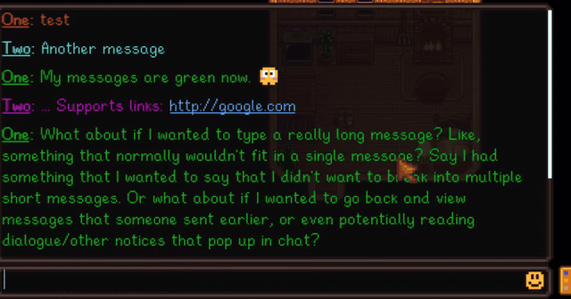
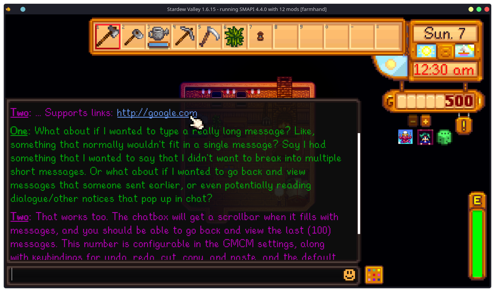
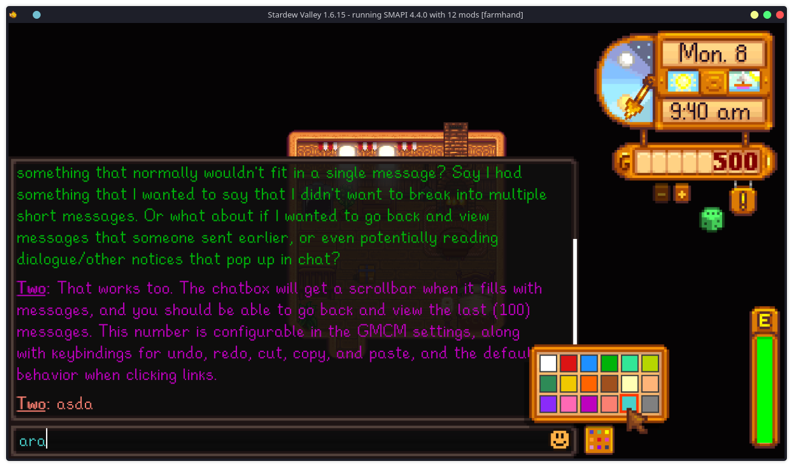
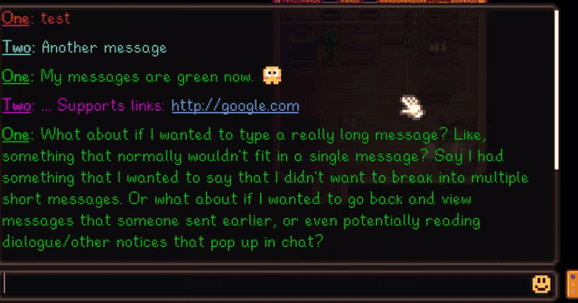
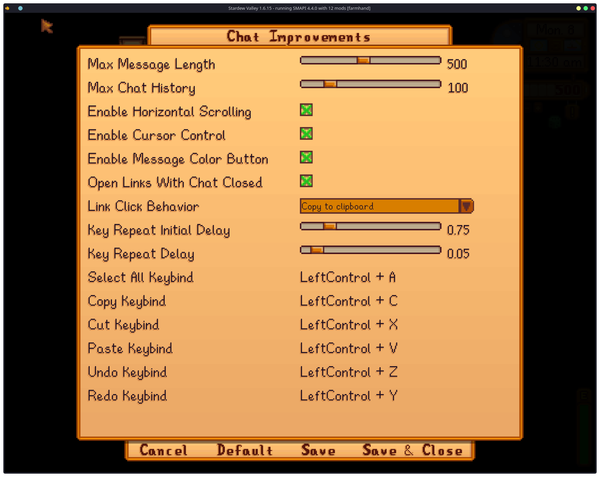

# Chat Improvements

A [Stardew Valley](https://stardewvalley.net/) mod that turns the chat box into a
proper text field: longer messages, scrollback, a real cursor, text selection,
undo, clipboard support, message colours, and clickable links.

Stardew's chat box stops accepting input once your text reaches the edge of the
box, keeps only a handful of messages, and offers no way to move the cursor,
select text, or fix a typo in the middle of a sentence. This fixes all of that.



## Features



**Longer messages.** Type up to 1,000 characters (500 by default) instead of
being cut off at the width of the box. The text scrolls sideways as you type.

**Scrollback.** Keeps up to 500 messages (100 by default) and lets you scroll
through them with the mouse wheel, instead of vanilla's short history.

**A working cursor.** Arrow keys, <kbd>Home</kbd> and <kbd>End</kbd> move the
cursor, and hold a key to repeat. Click anywhere in the box to put the cursor
there.

**Text selection.** Hold <kbd>Shift</kbd> with the arrow keys, click and drag,
or press <kbd>Ctrl</kbd>+<kbd>A</kbd>.

**Undo and redo.** <kbd>Ctrl</kbd>+<kbd>Z</kbd> and <kbd>Ctrl</kbd>+<kbd>Y</kbd>.

**Clipboard.** <kbd>Ctrl</kbd>+<kbd>C</kbd>, <kbd>Ctrl</kbd>+<kbd>X</kbd> and
<kbd>Ctrl</kbd>+<kbd>V</kbd>. Every keybind above is rebindable.

**Word-wise editing.** <kbd>Ctrl</kbd> with the arrow keys jumps by word;
<kbd>Ctrl</kbd>+<kbd>Backspace</kbd> and <kbd>Ctrl</kbd>+<kbd>Delete</kbd>
delete by word.

**Message colours.** A colour button next to the chat box lets you pick the
colour your messages are sent in, and your text previews in that colour as you
type.



**Clickable links.** URLs in chat are highlighted and underlined. Clicking one
copies it to your clipboard by default, or opens it in your browser if you
prefer — links come from other players, so the safe option is the default.



**Emoji-aware.** The cursor treats an emoji as a single character, so arrow keys
step over it and backspace removes the whole thing rather than half a tag.

**Properly international.** The cursor moves by grapheme cluster, not by byte, so
combining marks, Korean jamo and multi-codepoint emoji stay intact while you
edit. Text is measured with the same font it's drawn with, so the caret stays
aligned in Japanese, Korean, Chinese and Russian. Every player-facing string is
translatable.

## Installing

1. Install [SMAPI](https://smapi.io/) 4.0.0 or newer.
2. Download the latest release from the
   [releases page](https://github.com/sjohnson1021/StardewChatImprovements/releases)
   or from [Nexus Mods](https://www.nexusmods.com/stardewvalley).
3. Unzip it into your `Stardew Valley/Mods` folder.
4. Run the game using SMAPI.

[Generic Mod Config Menu](https://www.nexusmods.com/stardewvalley/mods/5098) is
optional but recommended — it lets you change every setting from the in-game
menu instead of editing a file.

## Configuration

Settings live in `config.json`, which SMAPI creates the first time you run the
mod. With Generic Mod Config Menu installed you can change them in-game instead.



| Setting                       | Default           | Description                                                   |
| ----------------------------- | ----------------- | ------------------------------------------------------------- |
| `MaxMessageLength`            | `500`             | Character limit per message (100–1000).                       |
| `MaxChatHistory`              | `100`             | Messages kept for scrollback (10–500).                        |
| `EnableHorizontalScrolling`   | `true`            | Scroll sideways while typing instead of stopping at the edge. |
| `EnableCursorControl`         | `true`            | Arrow keys, Home/End, selection and key repeat.               |
| `EnableMessageColorButton`    | `true`            | Show the message colour button next to the chat box.          |
| `KeyRepeatInitialDelay`       | `0.75`            | Seconds to hold a key before it repeats (0.25–3.0).           |
| `KeyRepeatDelay`              | `0.05`            | Seconds between repeats while held (0.01–0.5).                |
| `SelectAllKeybind`            | `LeftControl + A` | Select all text.                                              |
| `CopyKeybind`                 | `LeftControl + C` | Copy the selection.                                           |
| `CutKeybind`                  | `LeftControl + X` | Cut the selection.                                            |
| `PasteKeybind`                | `LeftControl + V` | Paste from the clipboard.                                     |
| `UndoKeybind`                 | `LeftControl + Z` | Undo the last change.                                         |
| `RedoKeybind`                 | `LeftControl + Y` | Redo the last undone change.                                  |
| `LinkClickBehavior`           | `Copy`            | What clicking a link does: `Copy` or `Open`. See below.        |
| `AllowUrlClickWhenChatClosed` | `false`           | Also allow clicking links with chat closed. See below.        |

### About the link settings

Both default to the cautious option, because links in chat come from other
players rather than from you.

`LinkClickBehavior` is **`Copy`** by default: clicking a link copies it to your
clipboard and tells you so, rather than launching a browser. You can look at the
address before deciding to visit it. Set it to `Open` if you'd rather click
straight through — reasonable if you only play with people you know.

`AllowUrlClickWhenChatClosed` is **off** by default because the mod does not
consume the click, so clicking a link while the chat box is closed *also*
performs the normal game action underneath it — swinging your tool, for example.

## Compatibility

- **Stardew Valley 1.6+**, SMAPI 4.0.0+, single player and multiplayer.
- **Multiplayer:** this is client-side. Other players don't need it, and they see
  your longer messages normally.
- **Other chat mods:** this Harmony-patches `ChatBox`, `ChatTextBox` and
  `ChatMessage`, so it will likely conflict with any other mod that changes how
  the chat box draws or handles input.
- **Linux:** the clipboard uses `wl-copy` / `wl-paste` on Wayland where
  available, and falls back to SDL2 otherwise.

## Translating

Every player-facing string lives in `i18n/`. See
[TRANSLATING.md](TRANSLATING.md) — translation pull requests are very welcome,
and partial translations are fine because SMAPI falls back to English per key.

## Building from source

The mod compiles against Stardew Valley's own assemblies, so you need the game
installed.

```bash
dotnet build
```

[ModBuildConfig](https://github.com/Pathoschild/SMAPI/blob/develop/docs/technical/mod-package.md)
finds the game automatically, builds a release zip into `bin/`, and copies the
mod into your `Mods` folder. If your game is in a non-standard location, see
[custom game paths](https://smapi.io/package/custom-game-path).

String keys in `i18n/default.json` generate a strongly-typed `I18n` class at
build time, so a renamed or missing key is a compile error rather than a blank
string in front of a player.

## Contributing

Bug reports and pull requests are welcome. When reporting a bug, please include
your SMAPI log (upload it to [smapi.io/log](https://smapi.io/log)) and say what
language you play in — several past issues have been locale-specific.

## License

[MIT](LICENSE).
